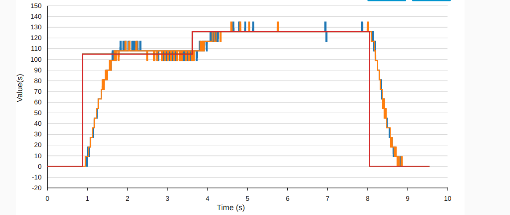
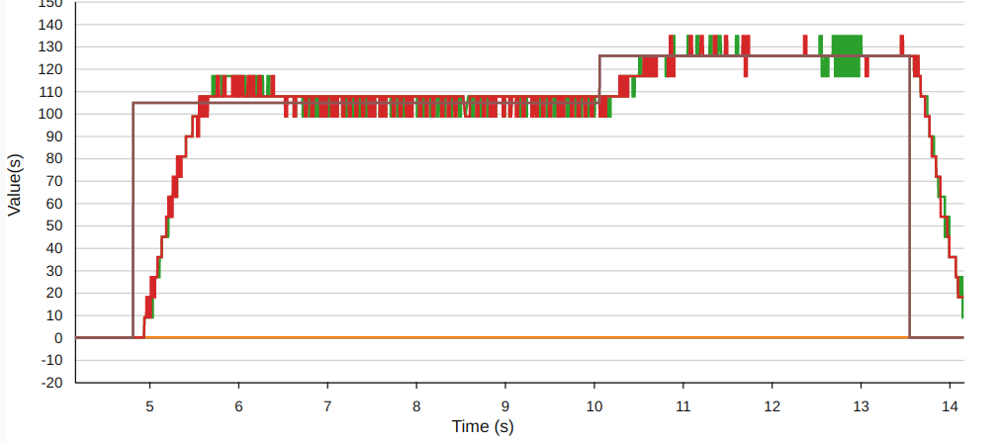

# fuzzy_based_pid_controller
This is the simple implementation of self-tuning-fuzzy-pid based on mamdani approach which uses the set of fuzzy rules to update the control parameters based on the input 
and setpoint given to the controller.This controller is basically built for tuning the response of motor using encoder data.U can integrate it into any system to get the required output as expected.

## Installation
Use a following command to clone the repository.

```bash
git clone https://github.com/love481/fuzzy_based_pid_controller.git
```
```bash
sudo apt install cmake
```

## Usage
Navigate to the folder and run:
```bash 
cmake .
make && ./pid
```
In order to use it give the input sensor data and tracking setpoint in the main.cpp file and print its behaviour.

##Motor response
 
## Contributing
Pull requests are welcome. For major changes, please open an issue first to discuss what you would like to change.

Please make sure to update tests as appropriate.

## License
[Apache](https://choosealicense.com/licenses/apache/)
